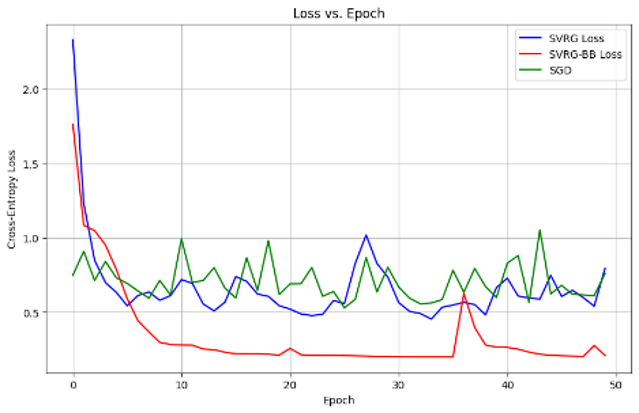
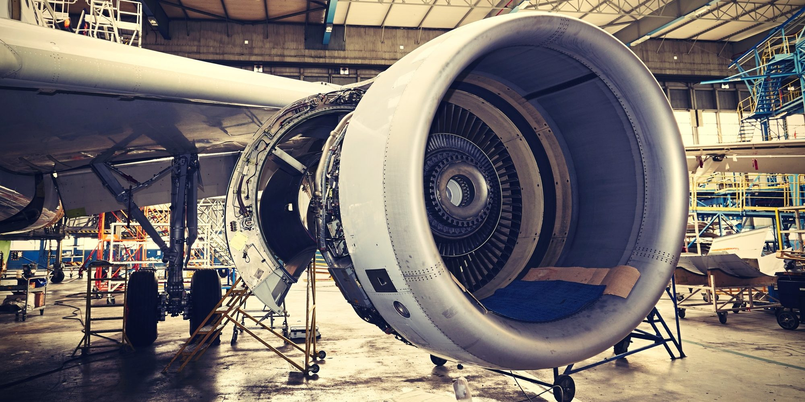
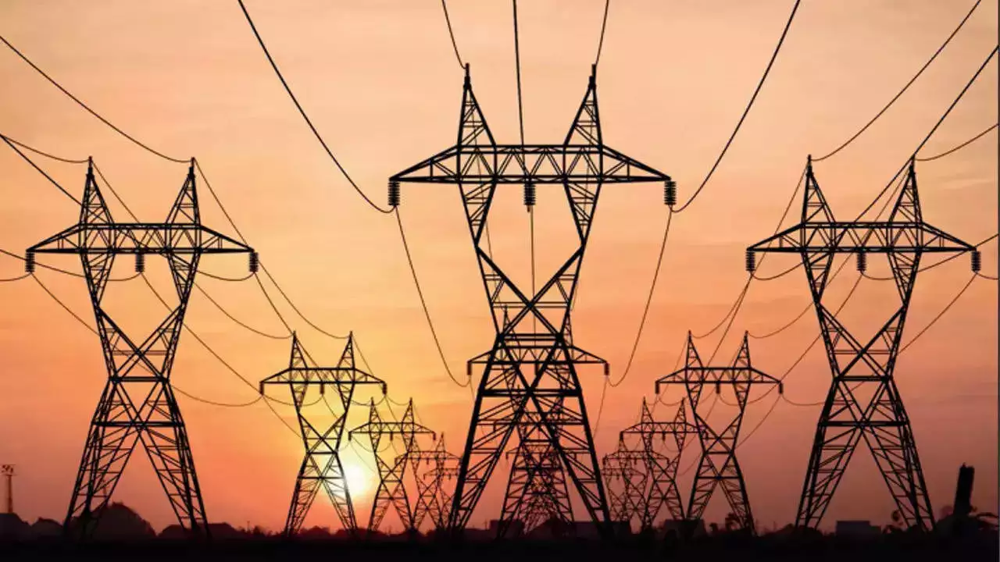
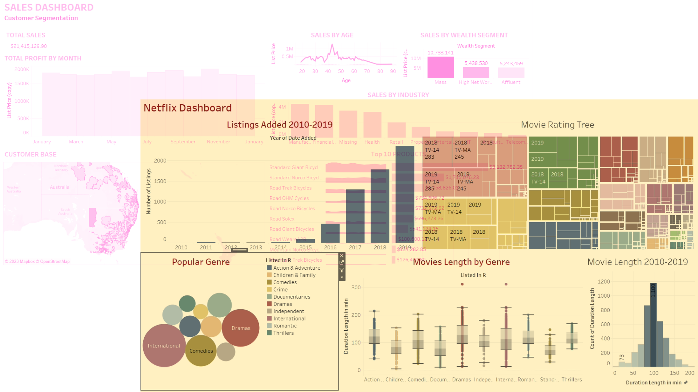
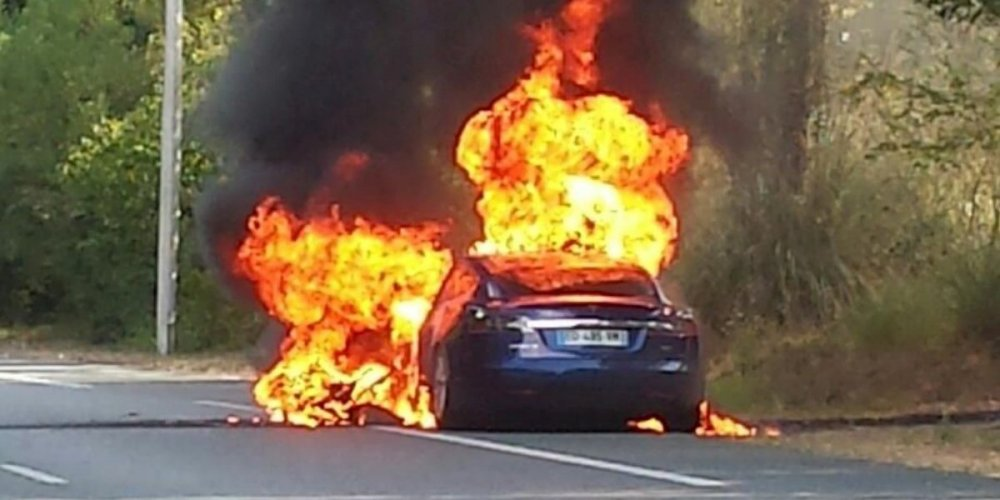
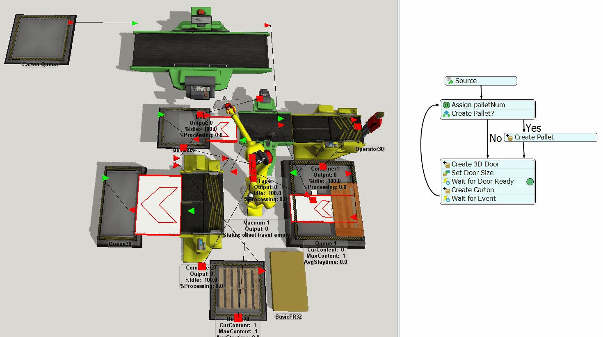

<!-- projects -->

  <section id="projects" class="portfolio-item">
  <h2>
    Barzilai-Bowerin Step Size for Stochastic Gradient Descent Paper Implementation
  </h2>

   

      

        

          
        

        

          <!-- <a href="#" class="research-proj-title">
          TODO 
          </a> -->
          

            Implemented the Barzilai-Borwein adaptive step size method for Stochastic Variance Reduced Gradient(SVRG) in Python.  Compared all three algorithms-SGD vs Stochastic Variance Reduced Gradient and SVGR using the Barzilai-Borwein method. Achieved 15% faster convergence on MNIST dataset using the proposed method.
             
             
            <!-- <b>
              May 2024
            </b> -->
            &nbsp;&nbsp;&bull;&nbsp;&nbsp;
            <a href="https://github.com/kkratos/Paper-Implementation-Barzilai-Borwein-Step-Size-for-Stochastic-Gradient-Descent"
            target="_blank">
              GitHub
            </a>
          

        

      

    

  </section>

  <section id="projects" class="portfolio-item">
  <h2>
    Electricity Price Forecasting: Autoregressive and LSTM Model
  </h2>

   

      

        

          
        

        

          <!-- <a href="#" class="research-proj-title">
          TODO 
          </a> -->
          

            Developed a electricity price forecasting model to predict day-ahead Locational Marginal Prices (LMP) using time-series analysis and machine learning. After extensive data exploration, which revealed strong daily and weekly seasonality, implemented and compared multiple models, including Seasonal ARIMAX and LSTM neural networks. The optimized LSTM model, enhanced with lagged features, seasonal differencing, and time-based variables, outperformed traditional statistical methods, achieving a MAE of 3.92 and RMSE of 9.21—outperforming the benchmark SARIMAX model (MAE: 4.05, RMSE: 9.87).
             
             
            <!-- <b>
              May 2024
            </b> -->
            &nbsp;&nbsp;&bull;&nbsp;&nbsp;
            <a href="https://github.com/kkratos/Electricity-Price-Forecasting-Project"
            target="_blank">
              GitHub
            </a>
          

        

      

    

  </section>
  <section id="projects" class="portfolio-item">
    <h2>
      AI in Decision Making and Control
    </h2>
    

      

        

          
        

        

          <a href="#" class="research-proj-title">
            Vehicle Trajectory Forecasting Using LSTM Networks
          </a>
          

            This project develops an LSTM-based deep learning model to predict a vehicle's future trajectory by analyzing its past movement patterns. The model takes 62 timesteps of sequential motion data (including position, velocity, and acceleration) as input and forecasts the vehicle's coordinates (Local_X, Local_Y) for the next 5 timesteps. The architecture consists of a 50-unit LSTM layer followed by two dense layers (30 and 10 units, ReLU activation), trained on 9,400 time-series files over 60 epochs using the Adam optimizer and MSE loss. Designed for applications in autonomous driving and traffic analysis, this model effectively captures temporal dependencies to enable accurate short-term trajectory predictions.
             
             
            <!-- <b>
              December 2022
            </b> -->
            &nbsp;&nbsp;&bull;&nbsp;&nbsp;
            <a href="https://github.com/kkratos/AI-Decision-Making-and-Control-Course-Projects"
            target="_blank">
              GitHub
            </a>
          

        

      

    

  </section>
  
  <section id="projects" class="portfolio-item">
    <h2>
      Data Mining and Analytics
    </h2>
    
 
      

        

          
        

        

          <a href="https://docs.google.com/presentation/d/1zNCyu7yM1hGsVfAu0PtWSrSqo8q09ZvbnaHwQeRdvXc/edit#slide=id.p"
          class="research-proj-title" target="_blank">
            Predictive Maintenance of Aircraft Engine
          </a>
          

            Predictive Maintenance techniques are employed to assess the condition of equipment, enabling proactive maintenance or failure prevention before issues occur. This approach is highly beneficial as it significantly reduces equipment downtime costs. To solve regression task of predicting the remaining useful life (RUL) of a machine, I built a LSTM model using keras library. [In Progress]
             
             
            <!-- <b>
              December 2023
            </b> -->
            &nbsp;&nbsp;&bull;&nbsp;&nbsp;
            <a href="https://github.com/kkratos/Predictive-Maintenance-of-Aircraft-Engine">
              GitHub
            </a>
          

        

      

    

    
 
      

        

          
        

        

          <a href="https://docs.google.com/presentation/d/1zNCyu7yM1hGsVfAu0PtWSrSqo8q09ZvbnaHwQeRdvXc/edit#slide=id.p"
          class="research-proj-title" target="_blank">
            Home Credit Default Risk
          </a>
          

            Developed a machine learning model for kaggle competition as part of course project to predict the likelihood of loan default for Home Credit Group, a financial institution serving underbanked populations. Performed extensive exploratory data analysis on a dataset of 300,000+ loan applications with 122 features. Preprocessed data by handling missing values, encoding features, and normalization. Compared Logistic Regression, Random Forest, and boosting methods, optimizing performance with AutoML (PyCaret/H2O.ai) for hyperparameter tuning. XGBoost achieved the best performance with an ROC-AUC score of 0.74.
             
             
            <!-- <b>
              December 2023
            </b> -->
            &nbsp;&nbsp;&bull;&nbsp;&nbsp;
            <a href="https://github.com/kkratos/Home-Credit-Default-Risk">
              GitHub
            </a>
          

        

      

    

    

      

        

          
        

        

          <a href="https://docs.google.com/presentation/d/1lTvI8ufdjC_ie17wo_yj4vBeuOUMRvxJmAsXBbnD3-o/edit#slide=id.p"
          class="research-proj-title" target="_blank">
            US Vehicle Accidents Analysis
          </a>
          

            This project aimed to analyze and extract insights from US road accident
            data spanning 2016-2022.I focused on examining California as the top state
            for road accidents within the United States. Through comprehensive analysis,
            it aimed to uncover the primary factors contributing to California's high
            accident rates compared to other states, identifying patterns and trends
            to inform targeted strategies for accident prevention and improving overall
            road safety.
             
             
            <!-- <b>
              Nov 2023
            </b> -->
            &nbsp;&nbsp;&bull;&nbsp;&nbsp;
            <a href="https://github.com/kkratos/US-Vehicle-Accidents-Pattern-Analysis/tree/main/Project"
            target="_blank">
              GitHub
            </a>
          

        

      

    

    

      

        

          
        

        

          <a href="https://github.com/kkratos/Building-Energy-Analysis"
          class="research-proj-title" target="_blank">
            Building Energy Analysis
          </a>
          

            Performed time series analysis on 500+ time-series meter data from buildings data genome project. Utilized K-means Clustering on electrical meter data to identify daily load profiles and implemented a k-nearest neighbor regression model to accurately predict energy consumption with a MAPE of 6.59%.
             
             
            <!-- <b>
              December 2022
            </b> -->
            &nbsp;&nbsp;&bull;&nbsp;&nbsp;
            <a href="https://github.com/kkratos/Building-Energy-Analysis"
            target="_blank">
              GitHub
            </a>
          

        

      

    

    

      

        

          
        

        

          <a href=""
          class="research-proj-title">
            Tableau Dashboards
          </a>
          

            I developed two interactive Tableau dashboards as part of my projects. One dashboard focused on Netflix movie analytics, offering insights into viewership trends, ratings, and popular genres. The other dashboard tracked retail sales data for a bicycle company operating in Australia, providing detailed analysis of sales performance, geographical distribution, and product trends.
             
             
            <!-- <b>
              Nov 2023
            </b> -->
            &nbsp;&nbsp;&bull;&nbsp;&nbsp;
            <a href="https://public.tableau.com/app/profile/kamalpatel/viz/Netflix_16999804373180/ProfilesofMoviesAdded2010-2019"
            target="_blank">
              Netflix
            </a>
            &nbsp;&nbsp;&bull;&nbsp;&nbsp;
            <a href="https://public.tableau.com/app/profile/kamalpatel/viz/SalesDashboard_16996559156500/Sales"
            target="_blank">
              Bicycle Sales
            </a>
          

        

      

    

  </section>
  <!-- Risk Analysis -->
  <section id="projects" class="portfolio-item">
    <h2>
      Risk Analysis
    </h2>
    

      

        

          
        

        

          <a href="#" class="research-proj-title">
            Risk Analysis for Failure of EV Batteries
          </a>
          

            Quantitative risk assesment associated with electric vehicle batteries using
            fault tree and event tree analysis, to identify potential
            failure modes and their probabilities, highlighting risks of component
            failure due to overheating. Performance risk assessment use cyclic life
            testing data to assess battery longevity and failure rates.key finding include the risk value of top event is only 8.19%.Reliability modeling using Weibull distribution and uncertainty analysis estimates mean time to failure (MTTF) of 13,080 hrs.
             
             
            <!-- <b>
              December 2022
            </b> -->
            &nbsp;&nbsp;&bull;&nbsp;&nbsp;
            <a href="https://drive.google.com/file/d/171DwMsI1L774TiRNUt-bis0X0G4FjnyI/view?usp=sharing"
            target="_blank">
              Report
            </a>
          

        

      

    

    
  </section>
  <!-- Simulation of Production Systems -->
  <section id="projects" class="portfolio-item">
    <h2>
      Simulation of Production Systems
    </h2>
    

      

        

          
        

        

          <a href="https://docs.google.com/presentation/d/1BZzvgnlkeKS1BIuX9DnHdslQ32W94SJWLdo1aZteWb8/edit#slide=id.g1f87997393_0_782"
          class="research-proj-title" target="_blank">
            Optimizing CNC Stations in Turbine Manufacturing
          </a>
          

            This project optimizes Mareana Turbine's production lines, identifying
            bottlenecks at QA and CNC stations through Flexsim simulation. Proposed
            enhancements include additional workstations for key impeller lines and
            adopting Industry 4.0 technologies like predictive maintenance and AI inspection
            to boost efficiency. The strategy aims to meet demand, increase revenue
            by $700K, and incorporate digital advancements at a $150K cost.
             
             
            <!-- <b>
              December 2022
            </b> -->
            &nbsp;&nbsp;&bull;&nbsp;&nbsp;
            <!-- <a href="https://drive.google.com/drive/folders/1qlgQ9tQ9yDmx3vQ_kYfpukQJ9BHeg7eI?usp=sharing">FlexSim</a>&nbsp;&nbsp;&bull;&nbsp;&nbsp; -->
            <a href="https://docs.google.com/presentation/d/13dYCWf3V5h09CD8wOvUKnMlCPqobRwyJ4_dV1gOskG4/edit?usp=sharing"
            target="_blank">
              Presentation
            </a>
          

        

      

    

  </section>

