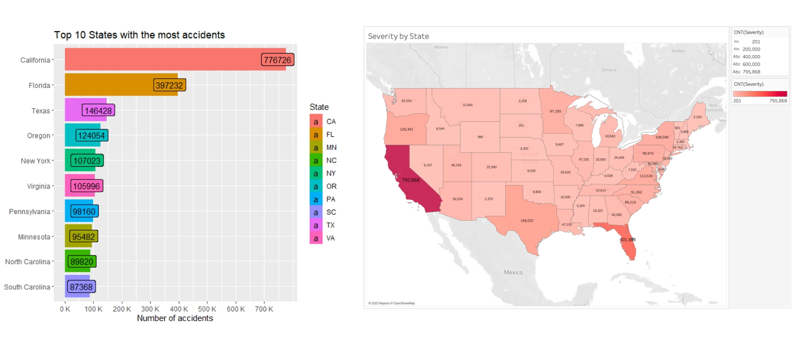
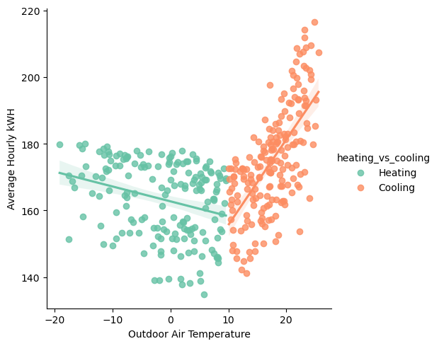

<!-- projects -->

  <section id="projects" class="portfolio-item">
    <h2>
      Data Mining and Analytics
    </h2>
    

      

        

          
        

        

          <a href="https://docs.google.com/presentation/d/1zNCyu7yM1hGsVfAu0PtWSrSqo8q09ZvbnaHwQeRdvXc/edit#slide=id.p"
          class="research-proj-title" target="_blank">
            Home Credit Default Risk
          </a>
          

            The objective of this project was to analyze and gain insights from the
            US road accident from 2016 to 2022 data to better understand the contributing
            factors, patterns, and trends associated with accidents. By examining the
            dataset, we aim to uncover valuable information that can help in developing
            strategies to reduce the number of accidents and improve road safety.
             
             
            <b>
              December 2023
            </b>
            &nbsp;&nbsp;&bull;&nbsp;&nbsp;
            <a href="https://github.com/kkratos/Home-Credit-Default-Risk">
              Code
            </a>
            &nbsp;&nbsp;&bull;&nbsp;&nbsp;
            <a href="https://docs.google.com/presentation/d/1zNCyu7yM1hGsVfAu0PtWSrSqo8q09ZvbnaHwQeRdvXc/edit#slide=id.p"
            target="_blank">
              report
            </a>
          

        

      

    

    

      

        

          
        

        

          <a href="https://docs.google.com/presentation/d/1lTvI8ufdjC_ie17wo_yj4vBeuOUMRvxJmAsXBbnD3-o/edit#slide=id.p"
          class="research-proj-title" target="_blank">
            US Vehicle Accidents Analysis
          </a>
          

            This project aimed to analyze and extract insights from US road accident
            data spanning 2016-2022.I focused on examining California as the top state
            for road accidents within the United States. Through comprehensive analysis,
            it aimed to uncover the primary factors contributing to California's high
            accident rates compared to other states, identifying patterns and trends
            to inform targeted strategies for accident prevention and improving overall
            road safety.
             
             
            <b>
              Nov 2023
            </b>
            &nbsp;&nbsp;&bull;&nbsp;&nbsp;
            <a href="https://github.com/kkratos/Data-Analytics-in-R/blob/main/Project/Final.R"
            target="_blank">
              Code
            </a>
            &nbsp;&nbsp;&bull;&nbsp;&nbsp;
            <a href="https://docs.google.com/presentation/d/1lTvI8ufdjC_ie17wo_yj4vBeuOUMRvxJmAsXBbnD3-o/edit#slide=id.p"
            target="_blank">
              report
            </a>
          

        

      

    

    

      

        

          
        

        

          <a href="https://github.com/kkratos/machine-learning/tree/main/Building%20Energy%20Analysis"
          class="research-proj-title" target="_blank">
            Building Energy Analysis
          </a>
          

            Performed time series analysis on 500+ time-series meter data from buildings data genome project. Utilized K-means Clustering on electrical meter data to identify daily load profiles and implemented a k-nearest neighbor regression model to accurately predict energy consumption with a MAPE of 6.59%.
             
             
            <b>
              December 2022
            </b>
            &nbsp;&nbsp;&bull;&nbsp;&nbsp;
            <a href="https://github.com/kkratos/machine-learning/tree/main/Building%20Energy%20Analysis"
            target="_blank">
              Code
            </a>
          

        

      

    

    

      

        

          
        

        

          <a href=""
          class="research-proj-title">
            Tableau Dashboards
          </a>
          

            I developed two interactive Tableau dashboards as part of my projects. One dashboard focused on Netflix movie analytics, offering insights into viewership trends, ratings, and popular genres. The other dashboard tracked retail sales data for a bicycle company operating in Australia, providing detailed analysis of sales performance, geographical distribution, and product trends.
             
             
            <b>
              Nov 2023
            </b>
            &nbsp;&nbsp;&bull;&nbsp;&nbsp;
            <a href="https://public.tableau.com/app/profile/kamalpatel/viz/Netflix_16999804373180/ProfilesofMoviesAdded2010-2019"
            target="_blank">
              Netflix
            </a>
            &nbsp;&nbsp;&bull;&nbsp;&nbsp;
            <a href="https://public.tableau.com/app/profile/kamalpatel/viz/SalesDashboard_16996559156500/Sales"
            target="_blank">
              Bicycle Sales
            </a>
          

        

      

    

  </section>
  <!-- Risk Analysis -->
  <section id="projects" class="portfolio-item">
    <h2>
      Risk Analysis
    </h2>
    

      

        

          
        

        

          <a href="#" class="research-proj-title">
            Risk Analysis for Failure of EV Batteries
          </a>
          

            Quantitative risk assesment associated with electric vehicle batteries using
            fault tree and event tree analysis, to identify potential
            failure modes and their probabilities, highlighting risks of component
            failure due to overheating. Performance risk assessment use cyclic life
            testing data to assess battery longevity and failure rates.key finding include the risk value of top event is only 8.19%. Reliability modeling using Weibull distribution and uncertainty analysis estimates mean time to failure (MTTF) of 13,080 hrs.
             
             
            <b>
              December 2022
            </b>
            &nbsp;&nbsp;&bull;&nbsp;&nbsp;
            <a href="https://drive.google.com/file/d/171DwMsI1L774TiRNUt-bis0X0G4FjnyI/view?usp=drive_link"
            target="_blank">
              Report
            </a>
          

        

      

    

    
  </section>
  <!-- Simulation of Production Systems -->
  <section id="projects" class="portfolio-item">
    <h2>
      Simulation of Production Systems
    </h2>
    

      

        

          
        

        

          <a href="https://docs.google.com/presentation/d/1BZzvgnlkeKS1BIuX9DnHdslQ32W94SJWLdo1aZteWb8/edit#slide=id.g1f87997393_0_782"
          class="research-proj-title" target="_blank">
            Optimizing CNC Stations in Turbine Manufacturing
          </a>
          

            This project optimizes Mareana Turbine's production lines, identifying
            bottlenecks at QA and CNC stations through Flexsim simulation. Proposed
            enhancements include additional workstations for key impeller lines and
            adopting Industry 4.0 technologies like predictive maintenance and AI inspection
            to boost efficiency. The strategy aims to meet demand, increase revenue
            by $700K, and incorporate digital advancements at a $150K cost.
             
             
            <b>
              December 2022
            </b>
            &nbsp;&nbsp;&bull;&nbsp;&nbsp;
            <!-- <a href="https://drive.google.com/drive/folders/1qlgQ9tQ9yDmx3vQ_kYfpukQJ9BHeg7eI?usp=sharing">FlexSim</a>&nbsp;&nbsp;&bull;&nbsp;&nbsp; -->
            <a href="https://docs.google.com/presentation/d/1BZzvgnlkeKS1BIuX9DnHdslQ32W94SJWLdo1aZteWb8/edit#slide=id.g1f87997393_0_782"
            target="_blank">
              Report
            </a>
          

        

      

    

  </section>

